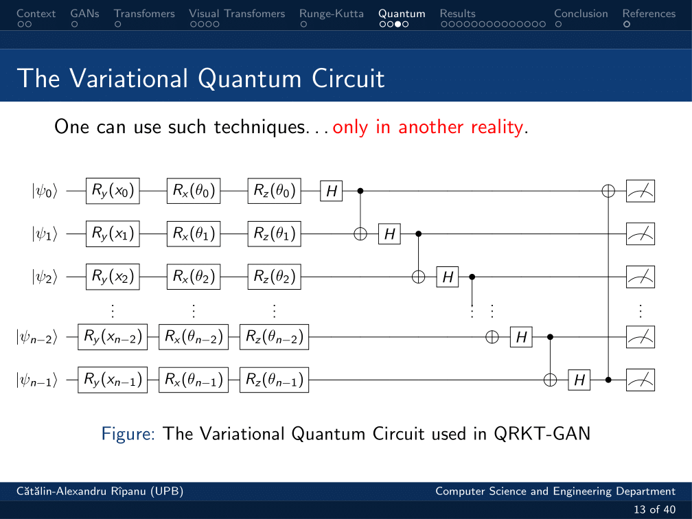
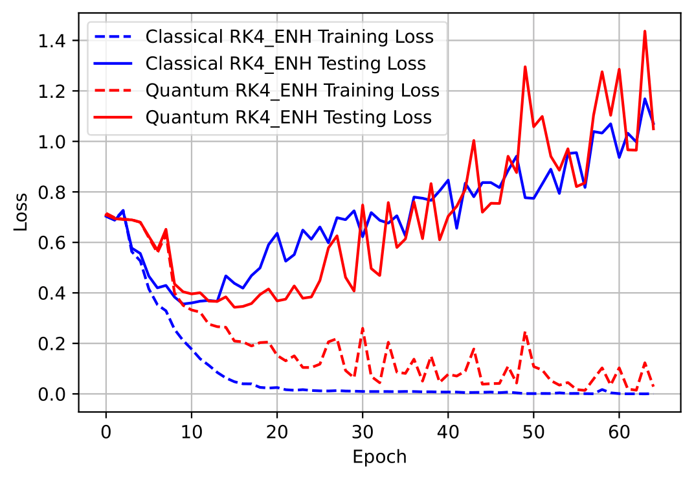

# Bachelor_Thesis
## A comprehensive study on Integrating Quantum Physics in Deep Learning Networks for Optimizations in Computer Vision and Natural Language Processing Fields

## QRKT-GAN: Neural Ordinary Differential Equation-Inspired Generative Adversarial Network with Numerical Runge-Kutta Methods for Quantum Visual Transformer-Based Generator and Discriminator

The oficial repository.

Soon to add the instructions of the setup to be able to run the quantum code.

TensorCircuit Python Library was used to simulate the proposed Variational Quantum Circuit (VQC).

Credits:
1. https://github.com/ML4SCI/QMLHEP/tree/main/Quantum_Transformers_Mar%C3%A7al_Comajoan_Cara
2. https://github.com/asarigun/TransGAN/tree/main?tab=readme-ov-file
